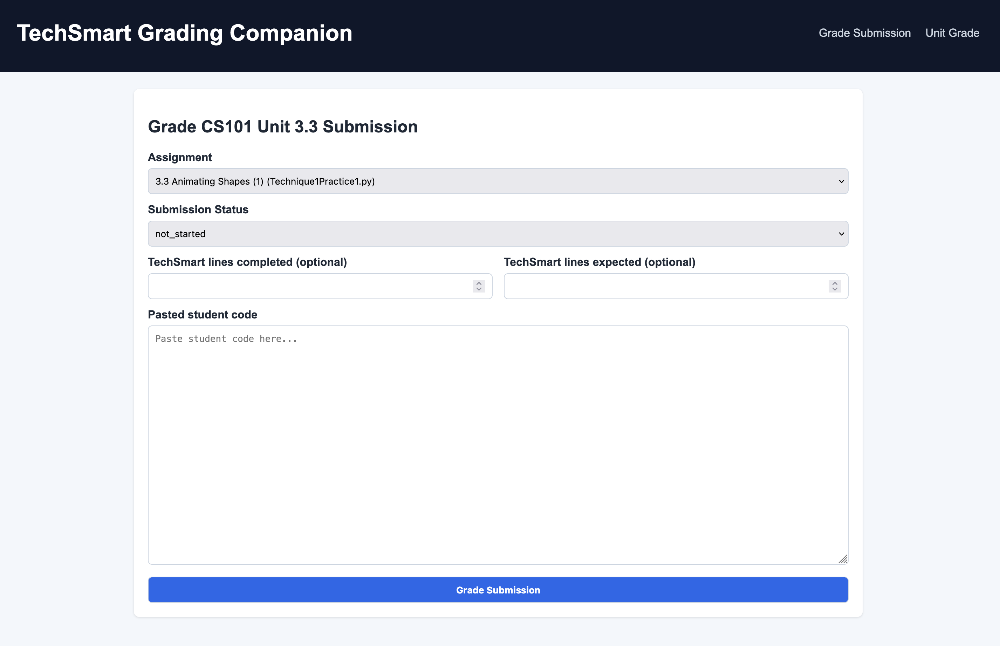
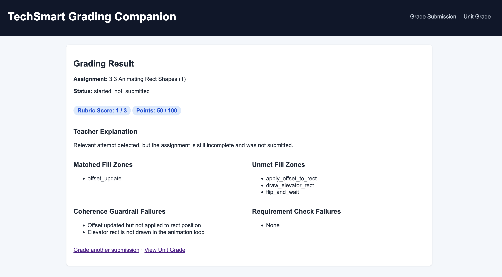
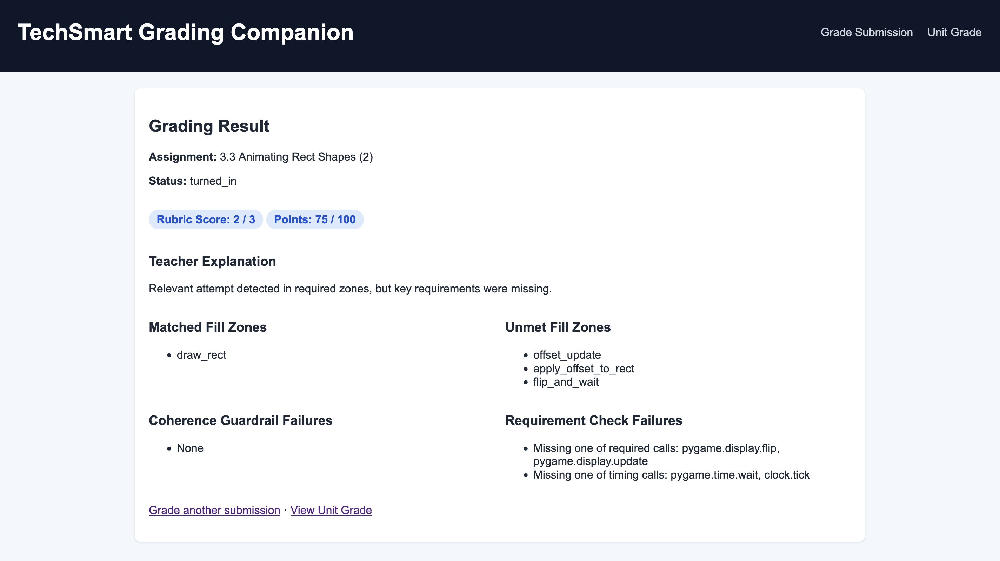
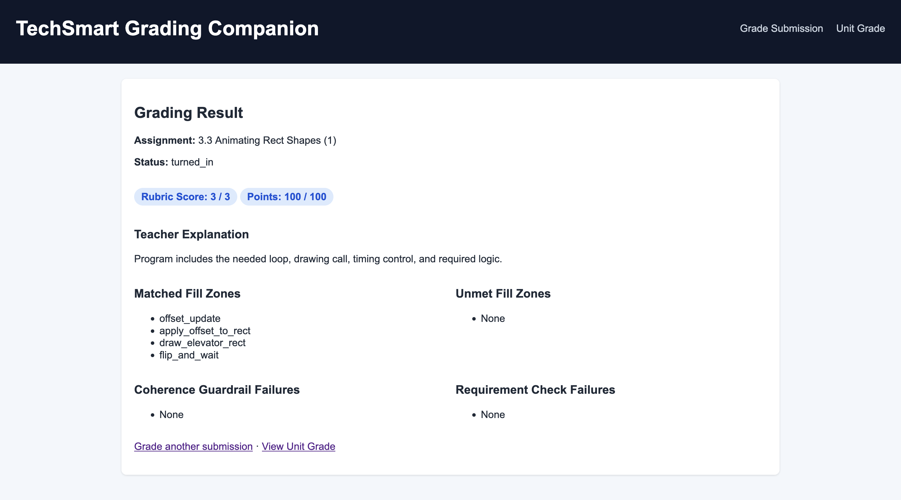

# TechSmart Grading Companion

TechSmart's built-in grading system evaluates student Python assignments using a **line-count proxy** — a pie chart bubble that fills as students write more lines of code. It does not verify that code runs, meets requirements, or demonstrates the intended concepts. This companion app addresses that gap with rubric-based scoring, fill-zone analysis, coherence guardrails, and a unit grade calculator.

> **MVP prototype** for TechSmart CS101 Unit 3.3 rubric grading. Prioritizes static checks and template-aware fill-zone matching over full runtime execution.

---

## Why I Built This

TechSmart evaluates student Python assignments using a **line-count proxy** — a pie chart bubble that fills as students write more lines of code. According to TechSmart's own Gradebook documentation, certain assignment indicators are evaluated by *number of lines of code written*. The only way a syntax error surfaces is if the student *runs* their program before turning it in. If they turn it in without running it, the system stays silent.

This creates a critical gap: students can game the system by copying random or incomplete lines of code to fill the completion bubble without writing functional programs. A full green bubble does not mean working code.

For a teacher managing 60+ students with anywhere from 6–15 programs per unit, manually running every submission to verify it actually executes and meets requirements is unsustainable. A two-week unit can mean 600–900 individual programs to check.

This companion app was built to close that gap — analyzing actual student code against assignment-specific rubric criteria, fill-zone expectations, and coherence guardrails, returning meaningful feedback that the TechSmart bubble system never provides.

The long-term vision is a browser extension that ingests student submissions automatically and flags incomplete or inaccurate work *before* it gets turned in — giving students specific, actionable feedback at the point of submission rather than after the fact.

---

## Screenshots

### Grade Submission


### Grading Result — Score 0


### Grading Result — Score 1 (50/100)


### Grading Result — Score 2 (75/100)


### Grading Result — Score 3 (100/100)


### Unit Grade Calculator


---

## What This App Does

- Grades pasted student code against a per-assignment YAML config for Unit 3.3
- Returns:
  - Rubric score (`0`, `1`, `2`, `3`)
  - Point score (`0`, `50`, `75`, `100`)
  - Teacher-facing explanation
  - Matched and unmet fill zones
  - Coherence guardrail failures
  - Requirement check failures
- Tracks graded assignments in-memory per session
- Computes a weighted **unit grade out of 100** with include/exclude toggles per assignment

---

## Stack

- Python 3.11+
- FastAPI
- Jinja2 templates
- PyYAML config loading
- pytest test suite

---

## Project Structure

```
app/main.py          – FastAPI routes + in-memory session results
app/config_loader.py – YAML-first / JSON-fallback config loader + validation
app/grader.py        – Grading engine and rule evaluation
app/models.py        – Typed dataclass models for config, request, and output
app/utils.py         – Parsing and matching helpers
templates/           – Server-rendered pages
static/style.css     – Minimal CSS
tests/test_grader.py – MVP grading rules tests
screenshots/         – App screenshots
```

---

## Setup

```bash
python -m venv .venv
source .venv/bin/activate
pip install -r requirements.txt
```

## Run Locally

```bash
uvicorn app.main:app --reload
```

Open: http://127.0.0.1:8000

## Run Tests

```bash
pytest -q
```

---

## Grading Rules

1. **Turned-in + 0 lines rule** — if `turned_in` and `lines_completed == 0` and `lines_expected > 0`, score is `0` immediately
2. **Status rules:**
   - `not_started` → score `0`
   - `started_not_submitted` → `0` if no relevant fill-zone attempt, `1` if at least one relevant zone matched
   - `turned_in` → `1`, `2`, or `3` based on meaningful attempt, syntax/requirement/coherence checks
3. **Meaningful attempt** — template-aware zone matching via `fill_zones`, excludes anti-pattern matches, requires minimum relevant zone matches
4. **Score 3 expectations** — expected patterns + requirement checks + guardrails must all pass, syntax validated via `ast.parse`

---

## MVP Assumptions & Limitations

- Runtime smoke execution intentionally disabled (pygame sandboxing is fragile in generic local environments)
- Coherence checks are text-based and intentionally lightweight; architecture is ready for deeper AST-based checks
- Session history is in-memory only — no DB, resets on server restart
- No authentication, TechSmart API integration, or browser extension yet
- Unit 3.3 only in current MVP; additional units in progress

---

## Roadmap

The app is structured for extensibility. Planned additions include:

- **Browser extension** — auto-ingests student code directly from TechSmart "More Actions → View" pages, eliminating manual copy/paste entirely; intercepts the Turn In button to run checks before submission is allowed
- **Student-facing pre-submit validation** — blocks turn-in and returns specific, actionable feedback when requirements are not met
- **Batch processing pipeline** — grades all submissions for a full class automatically, outputting a complete unit grade report per student
- **Anti-hardcode checks** — concept verification to ensure students used required structures (loops, functions, conditionals) rather than inflating line counts
- **AST-level semantic checks** for deeper code analysis
- **Safe runtime execution** via sandboxed environment
- **Additional units** beyond CS101 Unit 3.3
- **TechSmart API integration** if/when available
