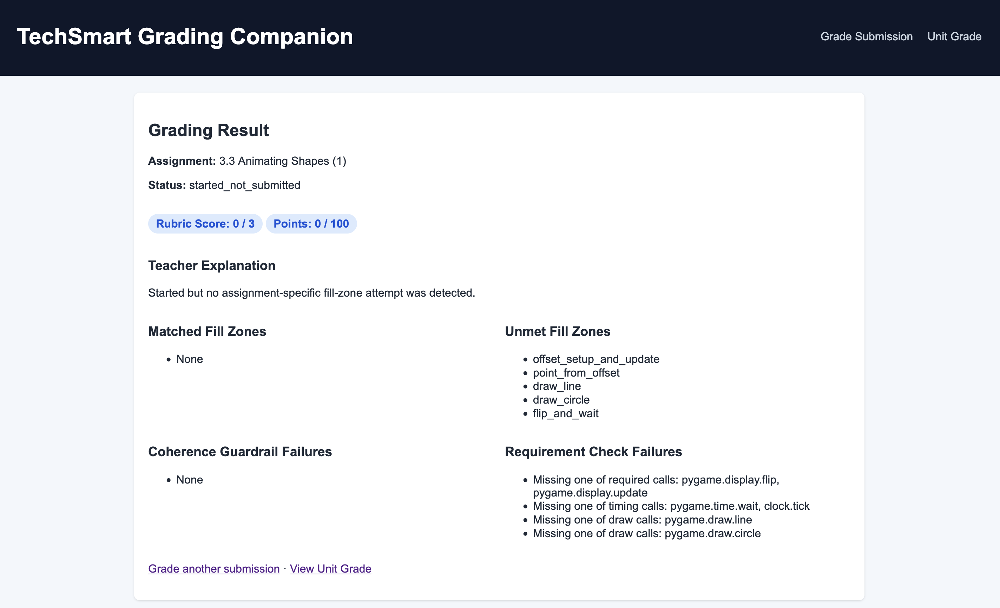
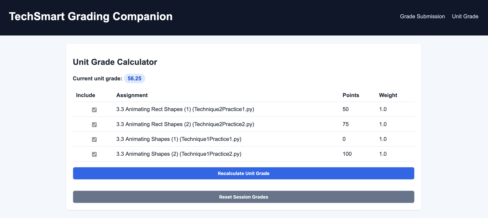

# TechSmart Grading Companion

TechSmart's built-in grading system provides limited feedback to teachers grading Python/Pygame assignments — showing only completion status, line counts, and syntax errors. This companion app addresses that gap with rubric-based scoring, fill-zone analysis, coherence guardrails, and a unit grade calculator.

> **MVP prototype** for TechSmart CS101 Unit 3.3 rubric grading. Prioritizes static checks and template-aware fill-zone matching over full runtime execution.

---

## Why I Built This

As a CS101 teacher using TechSmart daily, I found myself manually reviewing student code one submission at a time with no structured rubric feedback. TechSmart tells you *if* a student turned something in — not *how well* they did it. This tool was built to solve that problem directly in the classroom.

---

## Screenshots

### Grade Submission


### Grading Result — Score 0


### Grading Result — Score 1 (50/100)


### Grading Result — Score 2 (75/100)


### Grading Result — Score 3 (100/100)


### Unit Grade Calculator


---

## What This App Does

- Grades pasted student code against a per-assignment YAML config for Unit 3.3
- Returns:
  - Rubric score (`0`, `1`, `2`, `3`)
  - Point score (`0`, `50`, `75`, `100`)
  - Teacher-facing explanation
  - Matched and unmet fill zones
  - Coherence guardrail failures
  - Requirement check failures
- Tracks graded assignments in-memory per session
- Computes a weighted **unit grade out of 100** with include/exclude toggles per assignment

---

## Stack

- Python 3.11+
- FastAPI
- Jinja2 templates
- PyYAML config loading
- pytest test suite

---

## Project Structure

```
app/main.py          – FastAPI routes + in-memory session results
app/config_loader.py – YAML-first / JSON-fallback config loader + validation
app/grader.py        – Grading engine and rule evaluation
app/models.py        – Typed dataclass models for config, request, and output
app/utils.py         – Parsing and matching helpers
templates/           – Server-rendered pages
static/style.css     – Minimal CSS
tests/test_grader.py – MVP grading rules tests
assets/              – Screenshots
```

---

## Setup

```bash
python -m venv .venv
source .venv/bin/activate
pip install -r requirements.txt
```

## Run Locally

```bash
uvicorn app.main:app --reload
```

Open: http://127.0.0.1:8000

## Run Tests

```bash
pytest -q
```

---

## Grading Rules

1. **Turned-in + 0 lines rule** — if `turned_in` and `lines_completed == 0` and `lines_expected > 0`, score is `0` immediately
2. **Status rules:**
   - `not_started` → score `0`
   - `started_not_submitted` → `0` if no relevant fill-zone attempt, `1` if at least one relevant zone matched
   - `turned_in` → `1`, `2`, or `3` based on meaningful attempt, syntax/requirement/coherence checks
3. **Meaningful attempt** — template-aware zone matching via `fill_zones`, excludes anti-pattern matches, requires minimum relevant zone matches
4. **Score 3 expectations** — expected patterns + requirement checks + guardrails must all pass, syntax validated via `ast.parse`

---

## MVP Assumptions & Limitations

- Runtime smoke execution intentionally disabled (pygame sandboxing is fragile in generic local environments)
- Coherence checks are text-based and intentionally lightweight; architecture is ready for deeper AST-based checks
- Session history is in-memory only — no DB, resets on server restart
- No authentication, TechSmart API integration, or browser extension yet
- Unit 3.3 only in current MVP; additional units in progress

---

## Roadmap

The app is structured for extensibility. Planned additions include:

- **Browser extension** — auto-ingests student code directly from TechSmart "More Actions → View" pages, eliminating manual copy/paste entirely
- **Batch processing pipeline** — grades all submissions for a full class automatically, outputting a complete unit grade report
- **PDF/template diff helpers**
- **AST-level semantic checks** for deeper code analysis
- **Additional units** beyond CS101 Unit 3.3
- **TechSmart API integration** if/when available
